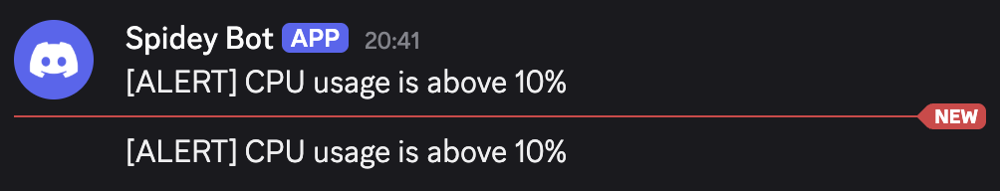

# Server Metric Alerts

## Testing Alert Mechanism

The easiest way to locally test that alert logic is working is expecting is via Django shell.

```bash
python manage.py shell
```

Let's add some rule to database and direct the corresponding alerts to Discord. For example,

```python
from monitoring.models import AlertRule

rule = AlertRule.objects.create(
    metric='cpu',
    operator='>',
    threshold=10,
    notify_message='CPU usage is above 10%',
    destinations=['discord'],
)
```

Next, we must create and save a `ServerStatus` instance to associate agent metric with.

```python
from django.utils import timezone
from monitoring.models import ServerStatus

server_status = ServerStatus.objects.create(
    hostname='test-server',
    ip='127.0.0.1',
    uptime=12345,
    timestamp=timezone.now(),
    os='linux',
    healthy=True,
    server_name='TestServer',
)
```

Finally, we can simulate some agent metric to see if we get a Discord alert.

```python
from monitoring.models import AgentMetric

AgentMetric.objects.create(
    cpu=50, timestamp=timezone.now(), server_status=server_status
w)
```

Voilá. If you're listening for alerts using Celery, you should get a Discord notification whenever the task runs according to its schedule. Otherwise, you can launch it manually in Django shell. Here is what I'm currently getting:


